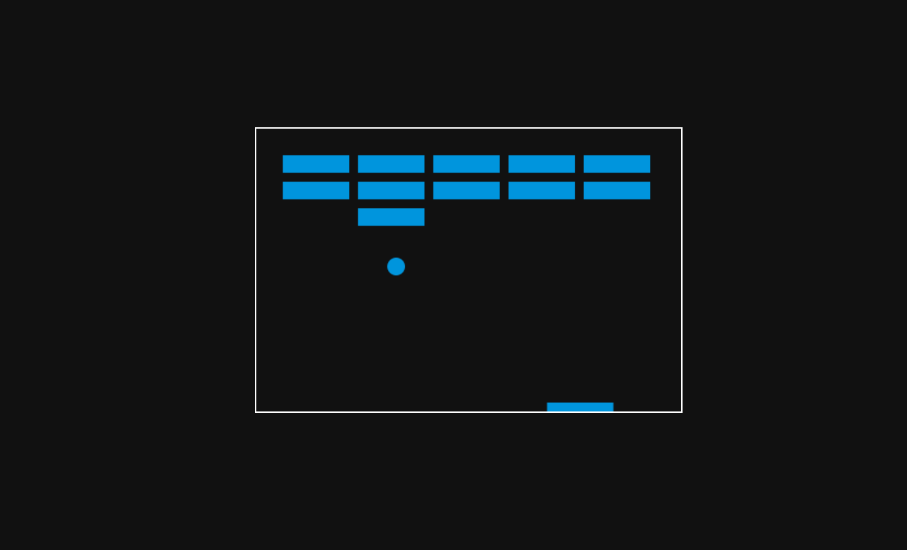

# Breakout Game

## Description

This is a simple Breakout game built using HTML, CSS, and JavaScript. The objective of the game is to control a paddle and bounce a ball to break all the bricks on the screen. The player must prevent the ball from falling off the screen by keeping it in play with the paddle.

### Features
- Paddle control using left and right arrow keys
- Brick breaking with collision detection
- Scoring system to track the player’s progress
- Simple, responsive design

---

## How to Play

1. Open the `index.html` file in your web browser.
2. Use the **left** and **right** arrow keys to move the paddle.
3. Break all the bricks to complete the level.
4. Score points by breaking bricks.

---

## Screenshot

---

## Technologies Used

- **HTML**: For the structure of the game
- **CSS**: For basic styling of the game interface
- **JavaScript**: For the game logic and interactivity

---

## License

This project is licensed under the MIT License - see the [LICENSE](LICENSE) file for details.
